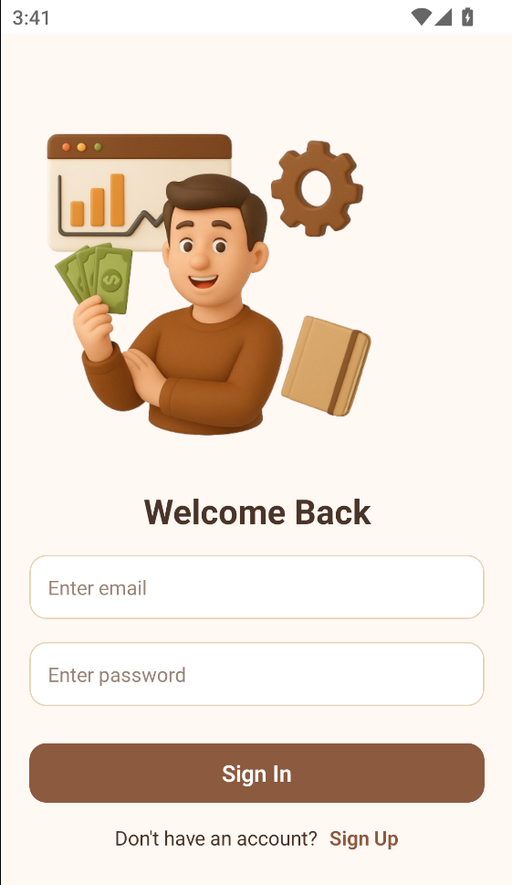
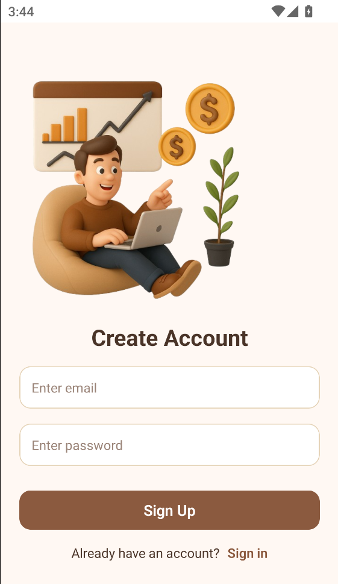
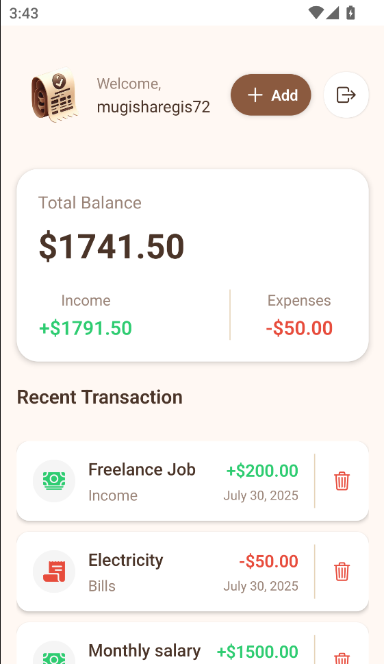
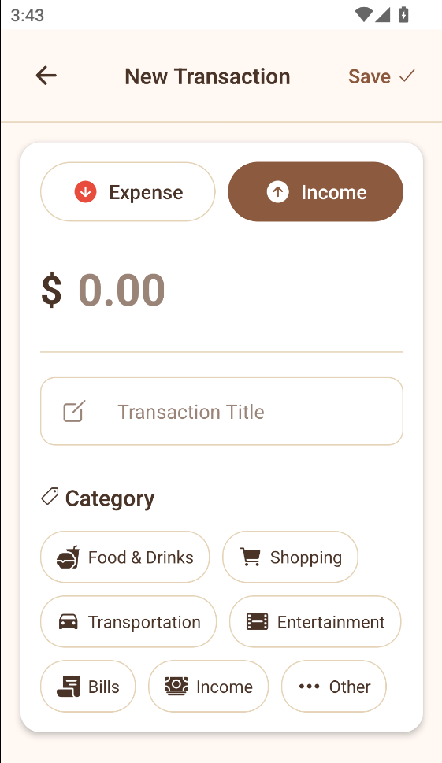

# 💰 React Native Wallet App

A modern, secure mobile wallet application built with React Native and Expo. Track your income, expenses, and manage transactions with a beautiful, intuitive interface.

## ✨ Features

- **🔐 Secure Authentication** - Powered by Clerk for robust user authentication
- **💰 Transaction Management** - Add, view, and delete transactions
- **📊 Financial Overview** - Real-time balance, income, and expense tracking
- **🎨 Modern UI** - Clean, responsive design with smooth animations
- **📱 Cross-Platform** - Works on iOS and Android
- **🔄 Real-time Sync** - Connected to a REST API for data persistence

## 📱 Screenshots

### Authentication Screens

<div style="display: flex; gap: 20px; margin: 20px 0;">
  
  
</div>

### Main App Screens

<div style="display: flex; gap: 20px; margin: 20px 0;">
  
  
</div>

## 🚀 Quick Start

### Prerequisites

- Node.js (v16 or higher)
- npm or yarn
- Expo CLI (`npm install -g @expo/cli`)

### Installation

1. **Clone the repository**

   ```bash
   git clone https://github.com/regis-mugisha/expo-wallet-mobile.git
   cd expo-wallet-mobile
   ```

2. **Install dependencies**

   ```bash
   npm install
   ```

3. **Start the development server**

   ```bash
   npx expo start
   ```

4. **Run on your device**
   - Scan the QR code with Expo Go app (iOS/Android)
   - Press `a` for Android emulator
   - Press `i` for iOS simulator

## 🏗️ Project Structure

```
mobile/
├── app/                    # Main app screens (Expo Router)
│   ├── (auth)/            # Authentication screens
│   └── (root)/            # Main app screens
├── components/             # Reusable UI components
├── hooks/                  # Custom React hooks
├── constants/              # App constants and config
├── styles/                 # Screen-specific styles
└── assets/                 # Images and fonts
```

## 🔧 Key Components

- **Authentication**: Clerk integration for secure sign-in/sign-up
- **Transaction Management**: Add, view, and delete transactions
- **Balance Tracking**: Real-time financial overview
- **Category System**: Organized transaction categories (Food, Shopping, etc.)

## 🛠️ Tech Stack

- **Framework**: React Native with Expo
- **Navigation**: Expo Router (file-based routing)
- **Authentication**: Clerk
- **State Management**: React Hooks
- **Styling**: React Native StyleSheet
- **Icons**: Expo Vector Icons
- **API**: REST API integration

## 📊 API Integration

The app connects to a REST API for data persistence:

- **Base URL**: `https://expo-wallet-api.onrender.com/api`
- **Endpoints**: Transactions CRUD operations
- **Authentication**: User-based data isolation

## 🎯 Available Scripts

```bash
npm start          # Start Expo development server
npm run android    # Run on Android emulator
npm run ios        # Run on iOS simulator
npm run web        # Run on web browser
npm run lint       # Run ESLint
```

## 🔐 Environment Setup

The app uses Clerk for authentication. Make sure to:

1. Set up your Clerk application
2. Configure environment variables if needed
3. Update API endpoints as required

## 🤝 Contributing

1. Fork the repository
2. Create a feature branch (`git checkout -b feature/amazing-feature`)
3. Commit your changes (`git commit -m 'Add amazing feature'`)
4. Push to the branch (`git push origin feature/amazing-feature`)
5. Open a Pull Request

## 📄 License

This project is licensed under the MIT License.

---

**Built with ❤️ using React Native and Expo**
